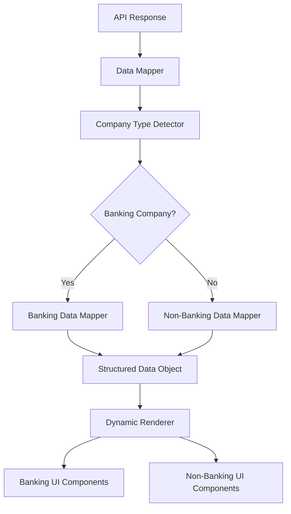
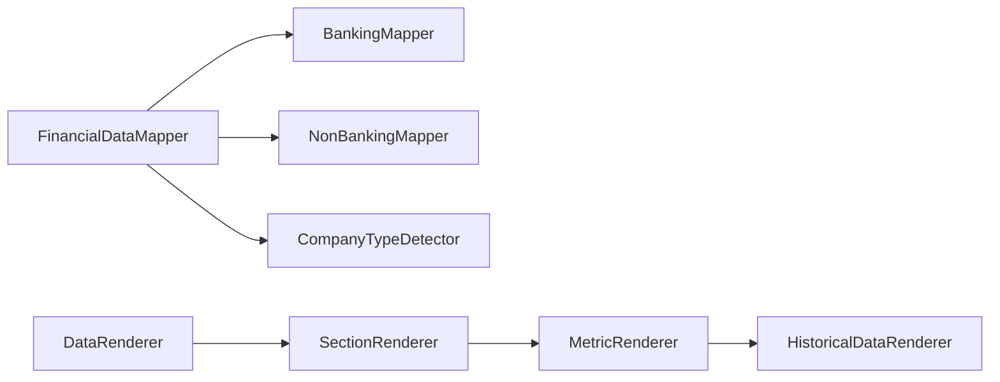

# Design Document

## Overview

The API Data Mapping and Rendering system is designed to handle complex nested financial data from the InsightSentry API and transform it into structured, type-safe data objects that can be dynamically rendered based on company type. The system uses a configuration-driven approach with separate mapping configurations for banking and non-banking companies.

## Architecture

### High-Level Architecture



### Component Architecture



## Components and Interfaces

### Core Data Interfaces

```typescript
interface FinancialMetric {
  id: string;
  name: string;
  currentValue: number | null;
  historicalValues: (number | null)[];
  unit: 'currency' | 'percentage' | 'ratio' | 'count';
  category: 'profitability' | 'liquidity' | 'solvency' | 'efficiency';
  period: 'FY' | 'FQ' | 'TTM';
}

interface FinancialSection {
  id: string;
  name: string;
  metrics: FinancialMetric[];
  subsections?: FinancialSection[];
}

interface CompanyFinancialData {
  companyType: 'banking' | 'non-banking';
  symbol: string;
  sections: FinancialSection[];
  lastUpdated: string;
}
```

### Mapping Configuration Interfaces

```typescript
interface FieldMapping {
  apiField: string;
  historicalField?: string;
  displayName: string;
  unit: 'currency' | 'percentage' | 'ratio' | 'count';
  category: string;
  section: string;
  subsection?: string;
  required: boolean;
  calculation?: (data: any) => number | null;
}

interface MappingConfig {
  companyType: 'banking' | 'non-banking';
  sections: {
    [sectionId: string]: {
      name: string;
      fields: FieldMapping[];
      subsections?: {
        [subsectionId: string]: {
          name: string;
          fields: FieldMapping[];
        };
      };
    };
  };
}
```

### Data Mapper Classes

```typescript
abstract class BaseDataMapper {
  protected config: MappingConfig;
  
  abstract mapData(apiResponse: any): CompanyFinancialData;
  protected extractMetric(apiResponse: any, mapping: FieldMapping): FinancialMetric;
  protected extractHistoricalData(apiResponse: any, field: string): (number | null)[];
}

class BankingDataMapper extends BaseDataMapper {
  constructor() {
    super();
    this.config = bankingMappingConfig;
  }
  
  mapData(apiResponse: any): CompanyFinancialData {
    // Implementation for banking-specific mapping
  }
}

class NonBankingDataMapper extends BaseDataMapper {
  constructor() {
    super();
    this.config = nonBankingMappingConfig;
  }
  
  mapData(apiResponse: any): CompanyFinancialData {
    // Implementation for non-banking mapping
  }
}
```

## Data Models

### Banking-Specific Data Structure

Based on the HDFC bank data mapping, the banking data structure includes:

```typescript
interface BankingMetrics {
  interestIncome: {
    netInterestIncome: FinancialMetric;
    netInterestMargin: FinancialMetric;
    interestIncomeFromLoans: FinancialMetric;
    interestExpenseOnDeposits: FinancialMetric;
  };
  deposits: {
    totalDeposits: FinancialMetric;
    demandDeposits: FinancialMetric;
    timeDeposits: FinancialMetric;
    casaRatio: FinancialMetric;
  };
  assetQuality: {
    grossNPA: FinancialMetric;
    netNPA: FinancialMetric;
    provisionCoverageRatio: FinancialMetric;
  };
  loans: {
    grossLoans: FinancialMetric;
    netLoans: FinancialMetric;
    loanLossProvisions: FinancialMetric;
  };
}
```

### Non-Banking Data Structure

Based on the historical data mapping:

```typescript
interface NonBankingMetrics {
  profitLoss: {
    revenue: FinancialMetric;
    grossProfit: FinancialMetric;
    operatingProfit: FinancialMetric;
    netProfit: FinancialMetric;
    ebitda: FinancialMetric;
  };
  balanceSheet: {
    totalAssets: FinancialMetric;
    totalLiabilities: FinancialMetric;
    shareholdersEquity: FinancialMetric;
  };
  cashFlow: {
    operatingCashFlow: FinancialMetric;
    investingCashFlow: FinancialMetric;
    financingCashFlow: FinancialMetric;
    freeCashFlow: FinancialMetric;
  };
}
```

## Error Handling

### Error Types

```typescript
enum MappingErrorType {
  MISSING_REQUIRED_FIELD = 'MISSING_REQUIRED_FIELD',
  INVALID_DATA_TYPE = 'INVALID_DATA_TYPE',
  CALCULATION_ERROR = 'CALCULATION_ERROR',
  COMPANY_TYPE_DETECTION_FAILED = 'COMPANY_TYPE_DETECTION_FAILED'
}

interface MappingError {
  type: MappingErrorType;
  field: string;
  message: string;
  originalValue?: any;
}
```

### Error Handling Strategy

1. **Graceful Degradation**: When optional fields are missing, continue processing other fields
2. **Fallback Values**: Use null or appropriate default values for missing data
3. **Error Logging**: Log all mapping errors for debugging purposes
4. **User Feedback**: Show appropriate messages for missing critical data

## Testing Strategy

### Unit Tests

1. **Data Mapper Tests**
   - Test field extraction with valid data
   - Test handling of missing fields
   - Test historical data array processing
   - Test calculation functions

2. **Company Type Detection Tests**
   - Test banking company detection
   - Test non-banking company detection
   - Test edge cases and fallbacks

3. **Configuration Tests**
   - Validate mapping configurations
   - Test configuration loading and parsing

### Integration Tests

1. **End-to-End Mapping Tests**
   - Test complete API response processing
   - Test rendering with mapped data
   - Test error scenarios

2. **Performance Tests**
   - Test processing large API responses
   - Test memory usage with historical data arrays

### Test Data

Create mock API responses based on the actual InsightSentry API structure:

```typescript
const mockBankingApiResponse = {
  // Based on the HDFC data structure you provided
  data: [
    {
      id: "interest_income_fy",
      value: 123456789,
      // ... other fields
    }
  ]
};

const mockNonBankingApiResponse = {
  // Based on standard financial data structure
  data: [
    {
      id: "revenue_fy",
      value: 987654321,
      // ... other fields
    }
  ]
};
```

## Implementation Considerations

### Performance Optimizations

1. **Lazy Loading**: Load historical data only when requested
2. **Memoization**: Cache processed data to avoid re-computation
3. **Chunked Processing**: Process large arrays in chunks to avoid blocking UI

### Scalability

1. **Modular Configuration**: Easy to add new company types or metrics
2. **Plugin Architecture**: Support for custom mappers and renderers
3. **Configuration Validation**: Ensure mapping configurations are valid at startup

### Accessibility

1. **Screen Reader Support**: Proper ARIA labels for financial data tables
2. **Keyboard Navigation**: Full keyboard accessibility for data exploration
3. **High Contrast**: Support for high contrast themes for better readability

### Internationalization

1. **Number Formatting**: Support for different number formats (Indian vs Western)
2. **Currency Display**: Proper currency formatting based on locale
3. **Date Formatting**: Consistent date formatting across components