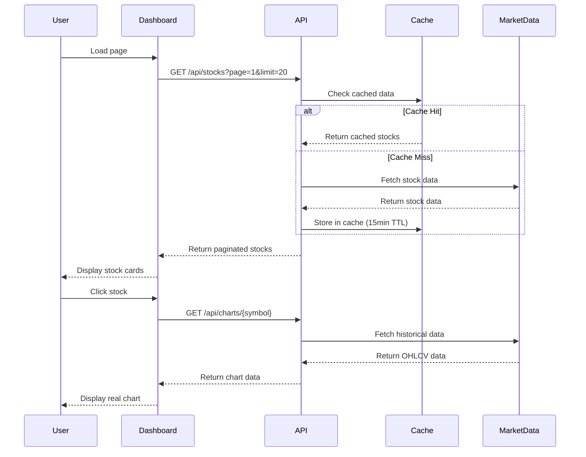

# Design Document

## Overview

This design addresses the critical issues in the stock screening application by implementing real historical data fetching for charts, efficient pagination and search, comprehensive BSE/NSE coverage, and a unified dark theme UI. The solution focuses on performance optimization, data accuracy, and user experience consistency.

## Architecture

### High-Level Architecture

```mermaid
graph TB
    UI[React Frontend] --> API[Next.js API Routes]
    API --> Cache[Redis Cache Layer]
    API --> Primary[Primary Market Data API]
    API --> Fallback[Fallback Data Sources]
    
    subgraph "Frontend Components"
        Dashboard[Dashboard Page]
        StockDetail[Stock Detail Page]
        Charts[Chart Components]
        Search[Search Components]
    end
    
    subgraph "API Layer"
        StockAPI[/api/stocks]
        ChartAPI[/api/charts]
        SearchAPI[/api/search]
    end
    
    subgraph "Data Sources"
        RapidAPI[RapidAPI Market Data]
        YahooFinance[Yahoo Finance API]
        AlphaVantage[Alpha Vantage API]
    end
    
    UI --> Dashboard
    UI --> StockDetail
    Dashboard --> Charts
    StockDetail --> Charts
    Dashboard --> Search
    
    API --> StockAPI
    API --> ChartAPI
    API --> SearchAPI
    
    Primary --> RapidAPI
    Fallback --> YahooFinance
    Fallback --> AlphaVantage
```

### Data Flow Architecture



## Components and Interfaces

### 1. Enhanced API Routes

#### `/api/stocks` Route Enhancement
```typescript
interface StockSearchParams {
  page?: number;
  limit?: number;
  search?: string;
  exchange?: 'NSE' | 'BSE' | 'ALL';
  sortBy?: 'market_cap' | 'volume' | 'change' | 'name';
  sortOrder?: 'asc' | 'desc';
  sector?: string;
  minMarketCap?: number;
  maxMarketCap?: number;
}

interface PaginatedStockResponse {
  data: StockData[];
  pagination: {
    page: number;
    limit: number;
    total: number;
    hasNext: boolean;
    hasPrev: boolean;
  };
  filters: {
    availableExchanges: string[];
    availableSectors: string[];
  };
}
```

#### New `/api/charts/[symbol]` Route
```typescript
interface ChartDataRequest {
  symbol: string;
  timeframe: '1D' | '1W' | '1M' | '3M' | '6M' | '1Y' | '2Y' | '5Y';
  interval?: '1m' | '5m' | '15m' | '1h' | '1d' | '1w';
  indicators?: string[];
}

interface ChartDataResponse {
  symbol: string;
  data: OHLCVData[];
  indicators?: TechnicalIndicators;
  metadata: {
    exchange: string;
    currency: string;
    timezone: string;
    lastUpdate: string;
  };
}

interface OHLCVData {
  timestamp: number;
  open: number;
  high: number;
  low: number;
  close: number;
  volume: number;
  date: string; // ISO format for display
}
```

#### New `/api/search` Route
```typescript
interface SearchRequest {
  query: string;
  exchanges?: string[];
  limit?: number;
  includeDelisted?: boolean;
}

interface SearchResponse {
  results: SearchResult[];
  suggestions: string[];
  totalCount: number;
}

interface SearchResult {
  symbol: string;
  name: string;
  exchange: string;
  sector?: string;
  marketCap?: number;
  lastPrice?: number;
  change?: number;
  matchType: 'exact' | 'partial' | 'fuzzy';
}
```

### 2. Frontend Component Redesign

#### Enhanced Dashboard Component
```typescript
interface DashboardState {
  stocks: StockData[];
  loading: boolean;
  error: string | null;
  pagination: PaginationState;
  filters: FilterState;
  searchQuery: string;
}

interface PaginationState {
  page: number;
  limit: number;
  total: number;
  hasNext: boolean;
}

interface FilterState {
  exchange: 'ALL' | 'NSE' | 'BSE';
  sector: string;
  sortBy: string;
  sortOrder: 'asc' | 'desc';
  marketCapRange: [number, number];
}
```

#### Real Chart Component
```typescript
interface RealStockChartProps {
  symbol: string;
  timeframe: TimeFrame;
  height?: number;
  showVolume?: boolean;
  indicators?: TechnicalIndicator[];
  theme?: 'light' | 'dark';
}

interface ChartState {
  data: OHLCVData[];
  loading: boolean;
  error: string | null;
  indicators: CalculatedIndicators;
  selectedTimeframe: TimeFrame;
}
```

#### Enhanced Search Component
```typescript
interface SearchComponentProps {
  onStockSelect: (stock: SearchResult) => void;
  placeholder?: string;
  exchanges?: string[];
  autoFocus?: boolean;
}

interface SearchState {
  query: string;
  results: SearchResult[];
  suggestions: string[];
  loading: boolean;
  showDropdown: boolean;
  selectedIndex: number;
}
```

### 3. Data Layer Services

#### Market Data Service
```typescript
class MarketDataService {
  private primaryAPI: RapidAPIClient;
  private fallbackAPIs: MarketDataAPI[];
  private cache: CacheService;

  async getHistoricalData(
    symbol: string, 
    timeframe: TimeFrame
  ): Promise<OHLCVData[]>;
  
  async getStockQuote(symbol: string): Promise<StockQuote>;
  
  async searchStocks(
    query: string, 
    options: SearchOptions
  ): Promise<SearchResult[]>;
  
  private async fetchWithFallback<T>(
    primaryFetch: () => Promise<T>,
    fallbackFetches: (() => Promise<T>)[]
  ): Promise<T>;
}
```

#### Cache Service
```typescript
interface CacheService {
  get<T>(key: string): Promise<T | null>;
  set<T>(key: string, value: T, ttl?: number): Promise<void>;
  invalidate(pattern: string): Promise<void>;
  
  // Specialized methods for stock data
  getStockData(symbol: string): Promise<StockData | null>;
  setStockData(symbol: string, data: StockData): Promise<void>;
  getChartData(symbol: string, timeframe: string): Promise<OHLCVData[] | null>;
  setChartData(symbol: string, timeframe: string, data: OHLCVData[]): Promise<void>;
}
```

## Data Models

### Enhanced Stock Data Model
```typescript
interface StockData {
  // Core identification
  symbol: string;
  name: string;
  exchange: 'NSE' | 'BSE';
  sector?: string;
  industry?: string;
  
  // Price data
  currentPrice: number;
  previousClose: number;
  change: number;
  changePercent: number;
  dayHigh: number;
  dayLow: number;
  
  // Volume and market data
  volume: number;
  avgVolume: number;
  marketCap: number;
  
  // Fundamental data
  pe?: number;
  pb?: number;
  dividendYield?: number;
  eps?: number;
  bookValue?: number;
  faceValue?: number;
  
  // Performance metrics
  week52High?: number;
  week52Low?: number;
  performanceWeek?: number;
  performanceMonth?: number;
  performanceYear?: number;
  
  // Metadata
  lastUpdated: string;
  currency: string;
  isActive: boolean;
}
```

### Chart Data Models
```typescript
interface TechnicalIndicators {
  sma?: {
    period: number;
    values: number[];
  }[];
  ema?: {
    period: number;
    values: number[];
  }[];
  rsi?: {
    period: number;
    values: number[];
  };
  macd?: {
    macd: number[];
    signal: number[];
    histogram: number[];
  };
  bollingerBands?: {
    upper: number[];
    middle: number[];
    lower: number[];
  };
}

interface ChartConfiguration {
  type: 'line' | 'area' | 'candlestick' | 'bar';
  timeframe: TimeFrame;
  indicators: string[];
  showVolume: boolean;
  theme: 'light' | 'dark';
  height: number;
}
```

## Error Handling

### Error Types and Handling Strategy

```typescript
enum ErrorType {
  NETWORK_ERROR = 'NETWORK_ERROR',
  API_RATE_LIMIT = 'API_RATE_LIMIT',
  INVALID_SYMBOL = 'INVALID_SYMBOL',
  NO_DATA_AVAILABLE = 'NO_DATA_AVAILABLE',
  CACHE_ERROR = 'CACHE_ERROR',
  VALIDATION_ERROR = 'VALIDATION_ERROR'
}

interface ErrorState {
  type: ErrorType;
  message: string;
  retryable: boolean;
  retryAfter?: number;
  fallbackAvailable: boolean;
}

class ErrorHandler {
  static handleChartError(error: Error, symbol: string): ErrorState;
  static handleSearchError(error: Error, query: string): ErrorState;
  static handleAPIError(error: APIError): ErrorState;
  static shouldRetry(error: ErrorState): boolean;
  static getFallbackData(error: ErrorState): any;
}
```

### Graceful Degradation Strategy

1. **Chart Data Failures**: Show last cached data with warning indicator
2. **Search Failures**: Fall back to client-side filtering of cached stocks
3. **API Rate Limits**: Implement exponential backoff and queue requests
4. **Network Issues**: Show offline indicator and cached data
5. **Invalid Symbols**: Provide suggestions for similar symbols

## Testing Strategy

### Unit Testing
- API route handlers with mocked external services
- Chart component rendering with various data scenarios
- Search functionality with different query types
- Error handling for all failure modes
- Cache service operations

### Integration Testing
- End-to-end stock search and selection flow
- Chart data fetching and rendering pipeline
- Pagination and infinite scroll behavior
- Real-time data updates and WebSocket connections

### Performance Testing
- Load testing with 1000+ concurrent users
- Chart rendering performance with large datasets
- Search response times with full stock database
- Memory usage during infinite scroll
- Cache hit/miss ratios and optimization

### User Acceptance Testing
- Stock discovery and search workflows
- Chart analysis and technical indicator usage
- Cross-exchange stock comparison
- Mobile responsiveness and touch interactions
- Accessibility compliance (WCAG 2.1 AA)

## Performance Optimizations

### Frontend Optimizations
1. **Virtual Scrolling**: For large stock lists
2. **Chart Data Virtualization**: Load only visible time range
3. **Component Memoization**: Prevent unnecessary re-renders
4. **Image Lazy Loading**: For stock logos and charts
5. **Bundle Splitting**: Separate chart libraries from main bundle

### Backend Optimizations
1. **Database Indexing**: On symbol, name, exchange, sector
2. **Query Optimization**: Efficient pagination and filtering
3. **Caching Strategy**: Multi-level caching (Redis + CDN)
4. **API Rate Limiting**: Prevent abuse and ensure fair usage
5. **Data Compression**: Gzip responses and WebSocket messages

### Caching Strategy
```typescript
interface CacheConfiguration {
  stockData: { ttl: 300 }; // 5 minutes
  chartData: { ttl: 900 }; // 15 minutes
  searchResults: { ttl: 1800 }; // 30 minutes
  marketIndices: { ttl: 60 }; // 1 minute
  fundamentalData: { ttl: 86400 }; // 24 hours
}
```

## Security Considerations

### API Security
1. **Rate Limiting**: Per-IP and per-user limits
2. **Input Validation**: Sanitize all search queries and parameters
3. **API Key Management**: Secure storage and rotation
4. **CORS Configuration**: Restrict to allowed origins
5. **Request Logging**: Monitor for suspicious patterns

### Data Privacy
1. **User Data**: No personal information stored without consent
2. **Search History**: Optional and user-controlled
3. **Watchlists**: Encrypted storage if user accounts added
4. **Analytics**: Anonymized usage tracking only

## Deployment and Monitoring

### Deployment Strategy
1. **Staging Environment**: Full replica for testing
2. **Blue-Green Deployment**: Zero-downtime updates
3. **Feature Flags**: Gradual rollout of new features
4. **Database Migrations**: Automated and reversible
5. **CDN Configuration**: Global content delivery

### Monitoring and Alerting
1. **API Performance**: Response times and error rates
2. **Chart Rendering**: Client-side performance metrics
3. **Search Accuracy**: Query success rates and user satisfaction
4. **Cache Performance**: Hit rates and invalidation patterns
5. **External API Health**: Monitor third-party service availability